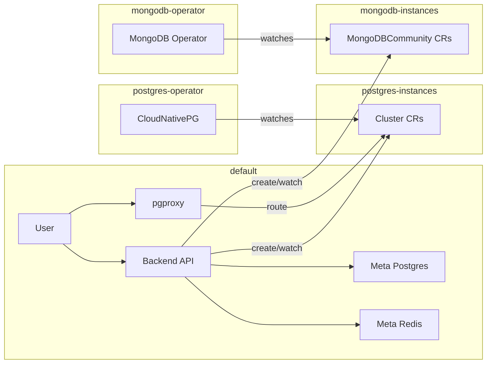

# Database-as-a-Service Backend

Backend API for a DBaaS platform. Provisions PostgreSQL and MongoDB instances via Kubernetes operators (CloudNativePG, MongoDB Community Operator) and exposes project management, query execution, schema, and table APIs.

---

## Architecture

- **Meta-DB**: PostgreSQL (app database, migrations, project metadata) and Redis. When using `start.sh`, both run **in-cluster** in the `default` namespace ([deploy/postgres.yaml](deploy/postgres.yaml), [deploy/redis.yaml](deploy/redis.yaml)).
- **Backend API**: Runs in `default` ([deploy/deployment.yaml](deploy/deployment.yaml), [deploy/service.yaml](deploy/service.yaml)). Uses the meta-DB and, via the Kubernetes client, provisions user DB instances in dedicated namespaces.
- **User DB instances**: PostgreSQL via **CloudNativePG** in `postgres-instances`; MongoDB via **MongoDB Community Operator** in `mongodb-instances`. The backend creates/updates/deletes `Cluster` (postgresql.cnpg.io) and `MongoDBCommunity` resources and reads Secrets for connection strings ([internal/services/operator_provisioner.go](internal/services/operator_provisioner.go)).
- **pgproxy**: A PostgreSQL SNI routing proxy ([cmd/pgproxy/main.go](cmd/pgproxy/main.go)) that routes incoming connections to the correct project instance. It peeks at the TLS ClientHello to extract SNI or uses the database field in plain connections, ensuring end-to-end TLS without termination.



---

## Key Features

- **Multi-Tenant DB Provisioning**: Automates PostgreSQL and MongoDB instance lifecycle via Kubernetes operators in isolated namespaces.
- **Transparent PG Routing**: Uses `pgproxy` for SNI-based routing, allowing users to connect to their specific project DBs via a single endpoint.
- **Streamed Backup & Restore**: Full-database export and import for PostgreSQL and MongoDB, streamed directly via HTTP to avoid local disk usage.
- **AI-Powered Text-to-SQL**: Natural language interface for generating database schemas and SQL queries.
- **OpenAPI Specification**: Full API documentation available in [openapi.yaml](openapi.yaml).

---

## K3s cluster (k3d)

The project uses a local **K3s** cluster (via **k3d** — K3s in Docker) to run the backend, meta Postgres/Redis, and operator-provisioned DB instances.

- **Cluster name**: `dbaas-local`
- **kubectl context**: `k3d-dbaas-local` ([scripts/k3s-local-setup.sh](scripts/k3s-local-setup.sh))

### Lifecycle

| Action | Command |
|--------|---------|
| **Create or ensure cluster** | `./scripts/k3s-local-setup.sh` — creates the cluster if missing, creates namespaces, installs operators and cert-manager, applies RBAC. |
| **Delete cluster** | `./scripts/k3d-cluster-delete.sh` — deletes the k3d cluster. For a clean start, run this then `k3s-local-setup.sh` and `start.sh`. |

### Operators installed by setup

- **CloudNativePG**: Installed via Helm in `postgres-operator` (separate namespace from instances). Uses cluster-wide watch (`config.clusterWide=true`); user `Cluster` resources are created only in `postgres-instances`. Chart creates ClusterRole/ClusterRoleBinding (`rbac.create=true`).
- **cert-manager**: Installed cluster-wide; required by the MongoDB operator for TLS.
- **MongoDB Community Operator**: Installed via Helm in `mongodb-operator`, watches only `mongodb-instances`. RBAC from [deploy/mongodb-operator-mongodb-instances-rbac.yaml](deploy/mongodb-operator-mongodb-instances-rbac.yaml).

---

## Namespaces

| Namespace | Purpose | Main resources |
|-----------|---------|----------------|
| **default** | Backend API, meta PostgreSQL, meta Redis | Backend Deployment/Service/ServiceAccount, `backend-config` ConfigMap, `backend-secrets` Secret, postgres/redis Deployments/Services/PVCs, `postgres-secrets` |
| **postgres-operator** | CloudNativePG operator only | Operator deployment; watches all namespaces (instances created in `postgres-instances`) |
| **postgres-instances** | User PostgreSQL instances | `Cluster` CRs, Secrets; backend has a Role here |
| **mongodb-instances** | User MongoDB instances | `MongoDBCommunity` CRs, Secrets; MongoDB operator and backend have Roles here |
| **mongodb-operator** | MongoDB Community Operator only | Operator deployment; watches `mongodb-instances` only |
| **cert-manager** | TLS (e.g. for MongoDB) | cert-manager components |

The backend targets instance namespaces via environment variables: `DB_INSTANCES_NAMESPACE_POSTGRES` (default `postgres-instances`) and `DB_INSTANCES_NAMESPACE_MONGO` (default `mongodb-instances`).

---

## RBAC

### Backend ([deploy/rbac.yaml](deploy/rbac.yaml))

Namespace-scoped only. **ServiceAccount** `backend` in `default` (used by the Backend Deployment).

- **postgres-instances**: Role `backend-db-instances` — create, get, list, watch, update, patch, delete on `postgresql.cnpg.io` `clusters` and core `secrets`. RoleBinding to `backend` ServiceAccount in `default`.
- **mongodb-instances**: Role `backend-db-instances` — same verbs for `mongodbcommunity.mongodb.com` `mongodbcommunity` and core `secrets`. RoleBinding to `backend` ServiceAccount in `default`.

### CloudNativePG operator

Installed via Helm in `postgres-operator` with `rbac.create=true`. The chart creates ClusterRole and ClusterRoleBinding so the operator can watch and manage resources cluster-wide; user `Cluster` resources are created only in `postgres-instances`.

### MongoDB operator ([deploy/mongodb-operator-mongodb-instances-rbac.yaml](deploy/mongodb-operator-mongodb-instances-rbac.yaml))

- ServiceAccounts in `mongodb-instances`: `mongodb-database`, `mongodb-kubernetes-database-pods`.
- Role `mongodb-operator-mongodb-instances` in `mongodb-instances`: pods, services, secrets, configmaps, statefulsets, poddisruptionbudgets, `mongodbcommunity` CRs. Bound to ServiceAccount `mongodb-kubernetes-operator` in `mongodb-operator`.
- Role `mongodb-database-pods` in `mongodb-instances`: get, list, watch on secrets, configmaps, pods. Bound to ServiceAccount `mongodb-database` in `mongodb-instances`.

---

## Infrastructure and setup

### Deploy manifests (`deploy/`)

- **default namespace**: [deployment.yaml](deploy/deployment.yaml), [service.yaml](deploy/service.yaml), [rbac.yaml](deploy/rbac.yaml), [postgres.yaml](deploy/postgres.yaml), [redis.yaml](deploy/redis.yaml). The `backend-config` ConfigMap and `backend-secrets` Secret are created by `start.sh` from `.env` (not committed).
- **MongoDB operator RBAC**: [mongodb-operator-mongodb-instances-rbac.yaml](deploy/mongodb-operator-mongodb-instances-rbac.yaml). Applied by both `k3s-local-setup.sh` and `start.sh`. CloudNativePG RBAC is created by its Helm chart.

### Scripts

| Script | Purpose |
|--------|---------|
| **start.sh** | Assumes the k3d cluster exists. Deploys meta Postgres and Redis in-cluster, builds the backend Docker image, imports it into k3d, creates `backend-config` and `backend-secrets` from `.env`, applies rbac/deployment/service and MongoDB operator RBAC, restarts the backend deployment, and port-forwards the API (default port 8081). Backend uses in-cluster config and meta DB host `postgres` in `default`. |
| **scripts/k3s-local-setup.sh** | Prerequisites: kubectl, Helm, Docker, k3d. Creates the k3d cluster, namespaces (postgres-operator, postgres-instances, mongodb-instances), installs CloudNativePG in postgres-operator, cert-manager, and the MongoDB operator in mongodb-operator, applies MongoDB operator RBAC. |
| **scripts/k3d-cluster-delete.sh** | Deletes the k3d cluster `dbaas-local`. |

### Environment variables

Create a `.env` file in the project root. Required at startup:

| Variable | Description | Example |
|----------|-------------|---------|
| `PORT` | HTTP server port | `8080` |
| `DB_HOST` | Meta PostgreSQL host | `localhost` (in-cluster: overridden by ConfigMap to `postgres`) |
| `DB_PORT` | Meta PostgreSQL port | `5432` |
| `DB_USERNAME` | Meta DB user | `postgres` |
| `DB_PASSWORD` | Meta DB password | (your password) |
| `DB_DATABASE` | App database name | `dbaas` |
| `DB_ADMIN_USER` | Admin DB user | `postgres` |
| `DB_ADMIN_PASSWORD` | Admin DB password | (your password) |
| `ACCESS_TOKEN_SECRET` | JWT access token secret | (long random string) |
| `REFRESH_TOKEN_SECRET` | JWT refresh token secret | (long random string) |
| `GOOGLE_CLIENT_ID` | Google OAuth client ID | (from Google Cloud Console) |
| `GOOGLE_CLIENT_SECRET` | Google OAuth client secret | (from Google Cloud Console) |
| `GOOGLE_REDIRECT_URL` | Google OAuth redirect URL | `http://localhost:8080/api/v1/auth/google/callback` |

Optional:

| Variable | Description | Default |
|----------|-------------|---------|
| `DB_CRED_ENCRYPTION_KEY` | AES key for encrypting stored DB credentials (must be stable across restarts) | — |
| `DB_INSTANCES_NAMESPACE_POSTGRES` | Namespace for PostgreSQL instances (CloudNativePG) | `postgres-instances` |
| `DB_INSTANCES_NAMESPACE_MONGO` | Namespace for MongoDB instances | `mongodb-instances` |
| `KUBECONFIG` | Path to kubeconfig (when backend runs outside the cluster) | unset = in-cluster config |
| `SCHEMA_AI_BASE_URL` | Base URL of the local AI schema generator service (used by schema-from-text streaming endpoint) | `http://localhost:8090` |

### Quick start

1. Create the local k3s cluster and install operators:
   ```bash
   ./scripts/k3s-local-setup.sh
   ```
2. Run the backend (meta-DB in cluster, build, deploy, port-forward):
   ```bash
   ./start.sh
   ```
   API is available at `http://localhost:8081` (or set `K8S_PORT`).

**Fresh restart** (delete cluster and start over):
```bash
./scripts/k3d-cluster-delete.sh
./scripts/k3s-local-setup.sh
./start.sh
```

### Backend on host

You can run the backend on your host with `KUBECONFIG` set. Project and DB provisioning will work, but in-cluster DNS for user DBs (e.g. `db-xxx-rw.postgres-instances.svc.cluster.local`) does not resolve from the host; you would need to port-forward each project’s DB Service and point the app at that address (not provided by default).

### Make targets

| Target | Description |
|--------|-------------|
| `make help` | List all targets |
| `make setup` | Create `.env` and run initial setup |
| `make deps` | Download and tidy Go modules |
| `make build` | Build binary to `bin/api` |
| `make run` | Run with `go run` (dev) |
| `make start` | Run `./start.sh` (k3d: meta-DB, deploy, port-forward) |
| `make test` | Run tests |
| `make k8s-local` | Run `./scripts/k3s-local-setup.sh` (create cluster, install operators) |
| `make docker-down` | Stop Docker Compose services |

### Production checklist

1. **Secrets** — Use strong, unique values for `ACCESS_TOKEN_SECRET`, `REFRESH_TOKEN_SECRET`, and `DB_CRED_ENCRYPTION_KEY`; never commit them.
2. **Database** — Use a managed PostgreSQL instance or a dedicated server; restrict network access.
3. **HTTPS** — Put the API behind a reverse proxy (e.g. nginx, Traefik) with TLS.
4. **Kubernetes** — Run the backend in-cluster when using operator-based provisioning; use a dedicated namespace and least-privilege RBAC.
5. **Logging and monitoring** — Add structured logging and metrics; consider health endpoints for load balancers and K8s probes.
